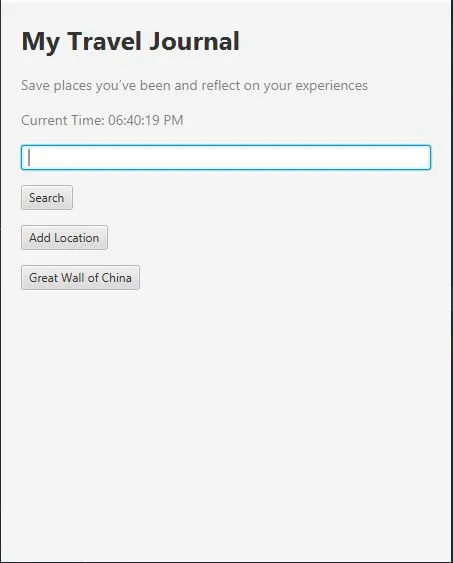

# Topic Integration
1. Java Overview / JVM / OOP Concepts
   -
   - LocationFileManager overrides methods from implemented interface LocationFileCreaton (LocationFileManager.java ; lines 28, 40)
        - 
   - LocationDetailView overrides methods from inherited abstract class LocationPage (LocationDetailView.java ; line 31)
2. Variables
   -
   - String name (Location.java ; line 24)
   - String description (Location.java ; line 25)
   - int ratingCount (Location.java ; line 29)
        - 
3. I/O
   -
   - java.io.File (LocationFileManager.java ; lines 31, 214)
   - java.io.BufferedReader (LocationFileManager.java ; line 42-43)
   - java.io.FileWriter (LocationFileManager.java ; line 43)
        - 
4. Control Flow
   -
   - for loops
        - (Location.java ; line 47)
        - (LocationFileManager.java ; lines 71, 88)
   - if loops / statements
        - (Location.java ; lines 37, 45)
        - (LocationFileManager.java ; lines 23, 31)
   - 
   - try-catch 
        - (LocationFileManager.java ; lines 29, 41, 60
        - (MainApplication.java ; line 56)
   - while loop (MainApplication.java ; line 233)
        - (LocationFileCreation.java ; line 96)
        - (MainApplication.java ; line 49, 154)
5. Methods
   -
   - Location(String name, String description) (Location.java ; line 31)
   - addRating(int rating, String review) (Location.java ; line 44)
   - startClockThread() (MainApplication.java ; line 44)
   - deleteLocationFile(String locationName) (LocationFileManager.java ; line 53)
        - 
6. Arrays
   -
   - int[] ratings (Location.java ; line 27)
   - String[] reviews (Location.java ; line 28)
        - 
7. Objects / Classes
   -
   - public class ClockService (ClockService.java)
   - public class Location (Location.java)
   - public class LocationDetailView (LocationDetailView.java)
   - public interface LocationFileCreation (LocationFileCreation.java)
   - public class LocationFileManager (LocationFileManager.java)
   - public abstract class LocationPage (LocationPage.java)
   - public class MainApplication.java (MainApplication.java)
        - 
8. Exceptions
   -
   - catching IOException (LocationFileManager.java ; lines 34, 47, 47, 76, 103)
        - 
   - catching NumberFormatException (MainApplication.java ; line 160)
9. Inheritance / Extending
    -
   - extending abstract class LocationPage in public class LocationDetailView (LocationDetailView.java ; line 20)
   - implementing interface LocationFileCreation in public class LocationFileManager (LocationFileManager.java ; line 17)
        - 
10. Robustness / Coding Standards
    -
    - JavaDoc comments at the top of each class
         - (LocationDetailView.java ; line 9)
              - 
         - (LocationFileCreation.java ; line 3)
12. MultiThreading
    -
    - creating clock thread (ClockService.java)
         - 
    - running the clock thread in the background (MainApplication.java ; lines 44-62)
14. JavafX
    -
    - (LocationDetailView.java)
         - 
    - (MainApplication.java ; lines 68-110, 126-189, 191-195)
         - 
